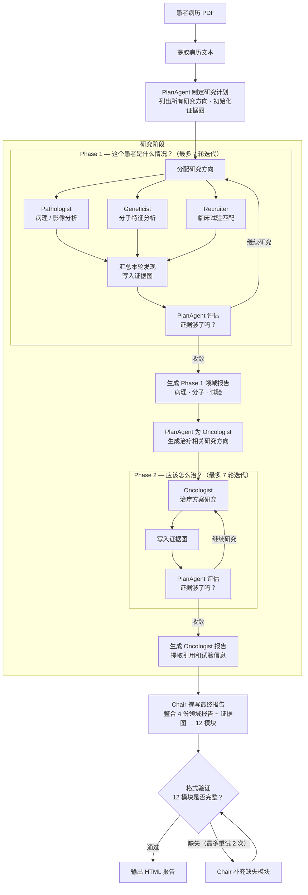

# MTB 系统架构设计文档

> 本文档描述 MTB 系统的架构设计决策和关键判断逻辑。
> 代码实现细节请参阅 [MTB_Architecture.md](MTB_Architecture.md)。

---

## 目录

- [术语说明](#术语说明)

0. [系统架构总览](#0-系统架构总览)
1. [系统设计理念](#1-系统设计理念)
2. [两阶段研究设计](#2-两阶段研究设计)
3. [研究模式选择逻辑](#3-研究模式选择逻辑)
4. [收敛判断机制](#4-收敛判断机制)
5. [证据图设计决策](#5-证据图设计决策)
6. [模型分层策略](#6-模型分层策略)
7. [报告生成策略](#7-报告生成策略)
8. [错误容忍设计](#8-错误容忍设计)

---

## 术语说明


| 术语                    | 含义                                                                                                                                         |
| ------------------------- | ---------------------------------------------------------------------------------------------------------------------------------------------- |
| **Agent（智能体）**     | 系统中承担特定角色的 AI 模块，类似一位专科医生。每个 Agent 拥有独立的专业知识和可调用的工具                                                  |
| **PlanAgent**           | 负责制定研究计划、评估研究进展和判断是否收敛的"总协调人" Agent                                                                               |
| **Chair（主席）**       | 最终报告的撰写者 Agent，汇总所有其他 Agent 的研究成果，输出 12 模块结构化报告                                                                |
| **研究方向**            | PlanAgent 分析病例后列出的具体研究任务，如"分析 EGFR L858R 变异的药物敏感性"。每个方向指定负责的 Agent、优先级和目标                         |
| **迭代**                | 一轮研究循环。每次迭代中，各 Agent 执行研究 → 更新证据图 → PlanAgent 评估进展。可理解为"研究的一个回合"                                    |
| **收敛**                | PlanAgent 判定当前证据已足够支撑高质量报告，不再需要继续研究。类似学术研究中"数据饱和"的概念                                                 |
| **广度优先研究 (BFRS)** | 对一个方向进行 1-2 次工具查询，快速覆盖尽可能多的相关信息。类似文献综述的初步筛查                                                            |
| **深度优先研究 (DFRS)** | 对一个方向进行 3-5 次连续深入查询，追踪引用链和证据来源。类似对关键论文的深入追踪                                                            |
| **证据图**              | 系统用来组织所有研究发现的结构化知识库。将每个发现拆解为实体（基因、药物等）、关系（敏感、耐药等）和观察（带等级的事实陈述和上下文溯源信息） |
| **证据等级 (A–E)**     | 基于 CIViC 标准的证据质量分级：A = 多项独立研究验证，B = 临床试验数据，C = 病例报告，D = 临床前研究，E = 间接推断                            |
| **完成度**              | 某个研究方向已收集证据的加权得分占目标分的百分比，用于量化"这个方向还差多少"                                                                 |
| **待深入研究线索**      | 研究 Agent 在工作中标记的"值得进一步追踪"的发现，如发现了耐药突变但缺乏临床验证数据                                                          |
| **Phase 1 / Phase 2**   | 两个研究阶段。Phase 1 由病理、遗传、试验三位 Agent 并行研究"患者是什么情况"；Phase 2 由 Oncologist 基于 Phase 1 结论研究"应该怎么治"         |

---

## 0. 系统架构总览



---

## 1. 系统设计理念

### 1.1 为什么用多 Agent 而非单一 LLM

**问题**: 肿瘤分子委员会报告涉及病理学、分子遗传学、临床试验、肿瘤内科等多个专业领域，单一 LLM 调用无法：

- 为每个领域配置专属工具集
- 对不同领域施加精确的角色约束
- 支持迭代式证据收集（单次调用的工具使用次数有限）

**设计决策**: 6 个专业 Agent，每个 Agent 拥有独立的：

- 系统提示词（领域专家角色）
- 工具集（只访问与其专业相关的 API）
- 温度参数（研究类偏低 0.2，综合类偏高 0.3）

### 1.2 为什么需要 Evidence Graph

**问题**: 传统 Agent 工作流中，各 Agent 产出的是自由文本，存在：

- 信息无法结构化对比（同一变异的不同 Agent 发现如何关联？）
- 证据质量无法量化（收集了多少 A 级证据？哪些方向还缺乏数据？）
- 收敛无法判断（研究做到什么程度算"够了"？）

**设计决策**: 引入 Entity-Edge-Observation 证据图作为全局知识载体：

- **结构化**: 每个发现被拆解为实体（基因、药物、疾病等）+ 关系（敏感、耐药、治疗等）+ 观察（带证据等级的事实陈述）
- **可量化**: 每个观察携带 CIViC 证据等级（A-E），可计算加权得分
- **可查询**: 收敛判断和报告生成都可以直接查询证据图

### 1.3 为什么用 PlanAgent 统一调度

**问题**: 早期设计中，各 Agent 独立决定自己的研究方向，导致：

- 研究方向重叠（两个 Agent 查同一篇文献）
- 覆盖不均（某些报告模块缺乏证据）
- 无统一收敛标准

**设计决策**: PlanAgent 承担三个职责：

1. **初始规划**: 分析病例后，生成结构化研究计划（包含 10-15 个研究方向），每个方向指定负责 Agent、优先级、目标模块
2. **动态调整**: 每次迭代后评估证据质量，调整研究方向的优先级和模式
3. **收敛判断**: 统一判断何时停止研究、进入下一阶段

---

## 2. 两阶段研究设计

### 2.1 为什么分两个阶段

**核心原因**: Oncologist 的治疗决策必须建立在其他 Agent 的研究结论之上。

```
Phase 1 回答: "这个患者是什么情况？"
  - Pathologist: 病理分型、分期、影像特征
  - Geneticist: 基因变异、通路分析、耐药机制
  - Recruiter: 可匹配的临床试验

Phase 2 回答: "应该怎么治？"
  - Oncologist: 基于 Phase 1 结论制定治疗方案
                ↑ 必须知道分子特征才能选药
                ↑ 必须知道有哪些试验才能推荐
                ↑ 必须知道耐药机制才能规划后线
```

如果所有 Agent 并行研究，Oncologist 在不了解分子特征的情况下制定治疗方案，会导致方案与实际情况脱节。

### 2.2 Phase 1: 为什么并行

Phase 1 的三个 Agent 研究的是**独立的知识领域**：

- Pathologist 查病理数据库 → 不依赖其他 Agent
- Geneticist 查变异数据库 → 不依赖其他 Agent
- Recruiter 查临床试验库 → 不依赖其他 Agent

并行执行可以将 Phase 1 的研究时间从 3x 降低到 1x。

**并行状态合并**: LangGraph 的 `Send()` 机制让三个 Agent 同时执行，通过自定义 Reducer 合并各自对 EvidenceGraph 和 ResearchPlan 的更新（按 canonical_id 去重合并实体，按方向 ID 合并研究进展）。

### 2.3 Phase 2: 为什么串行

Phase 2 只有 Oncologist 一个 Agent，因为：

- 治疗方案需要综合所有 Phase 1 信息
- Oncologist 需要查询药物相互作用、剂量调整等，这些依赖于已知的分子特征
- Phase 2 的研究方向由 PlanAgent 根据 Phase 1 报告**专门生成**

### 2.4 Phase 1 → Phase 2 转换

Phase 1 收敛后，系统执行三个步骤：

1. **报告合成**: 每个 Phase 1 Agent 从 EvidenceGraph 中提取**自己收集的证据**，生成领域报告
2. **方向生成**: PlanAgent 读取三份领域报告，生成 Oncologist 专用的研究方向（如 "评估 EGFR L858R 一线治疗方案"、"分析铂类联合方案安全性"）
3. **Phase 2 启动**: Oncologist 带着 Phase 1 报告作为上下文、新的研究方向作为任务，开始独立研究

---

## 3. 研究模式选择逻辑

### 3.1 BFRS vs DFRS

系统支持两种研究模式，模拟人类研究员的行为：


|              | BFRS (广度优先)        | DFRS (深度优先)         |
| -------------- | ------------------------ | ------------------------- |
| **类比**     | 文献综述的初步扫描     | 对关键发现的深入追踪    |
| **工具调用** | 1-2 次/方向            | 3-5 次连续              |
| **目标**     | 发现尽可能多的相关证据 | 提升已有证据的等级      |
| **适用场景** | 研究初期、证据稀少时   | 有 D/E 级证据需要验证时 |

### 3.2 模式分配机制

PlanAgent 在每次迭代后，为**每个研究方向**独立分配下一轮的研究模式。

#### PlanAgent LLM 综合判断（主路径）

模式分配的主要决策者是 PlanAgent LLM。它在每次迭代后会：

1. **阅读每个方向的完整证据**：包括已收集的实体、关系、观察内容及其证据等级，确保判断基于全量信息
2. **评估证据质量与覆盖率**：该方向的完成标准是否被已有发现所覆盖？关键问题是否已有高等级证据支撑？
3. **审查待深入研究线索**：研究 Agent 在工作中可能标记"需要进一步追踪"的发现（例如发现了某个耐药突变但缺乏临床验证数据）。PlanAgent LLM 会逐条判断这些线索是否已被后续研究覆盖、对报告质量的影响程度（关键 / 重要 / 次要）
4. **为每个方向选择模式并给出理由**：
   - **skip** — 证据充分、待深入项均已覆盖 → 不再研究
   - **广度优先 (BFRS)** — 覆盖面不足、多个关键问题尚未触及 → 先铺开收集
   - **深度优先 (DFRS)** — 证据等级偏低、存在矛盾、或有关键待深入项未解决 → 集中深入

#### 保底规则（回退路径）

当 PlanAgent LLM 的输出无法正常解析时，系统使用程序化规则确保研究仍能推进：

```
                ┌───────────────────┐
                │   评估方向完成度    │
                └─────────┬─────────┘
                          │
               ┌──────────▼──────────┐
               │ 有待深入研究线索?     │
               └───┬────────────┬────┘
                   │ 是         │ 否
                   ▼            ▼
           ┌──────────┐  ┌──────────────────┐
           │ 深度优先  │  │  完成度 ≥ 80%     │
           │ (DFRS)   │  │  且有 A/B 级证据?  │
           │ 强制      │  └───┬──────────┬───┘
           └──────────┘      │ 是       │ 否
                             ▼          ▼
                         ┌──────┐  ┌────────────────┐
                         │ skip │  │  完成度 < 60%?  │
                         └──────┘  └───┬────────┬───┘
                                       │ 是     │ 否
                                       ▼        ▼
                               ┌──────────┐  ┌──────────┐
                               │ 广度优先  │  │ 深度优先  │
                               │ (BFRS)   │  │ (DFRS)   │
                               └──────────┘  └──────────┘
```

保底规则要点：

- **待深入研究线索优先级最高**：只要方向上存在 Agent 标记的待深入项，一律分配深度优先
- **skip**: 完成度 ≥ 80% 且有高质量证据 → 无需继续
- **广度优先**: 完成度不足 60% → 先扩大覆盖面
- **深度优先**: 其余情况（60-80% 或仅有低质量证据）→ 深入追踪

### 3.3 迭代间模式演变

典型研究过程的模式演变：

```
迭代 1: 全部 BFRS  → 广泛收集初步证据
迭代 2: 大部分 BFRS → 补充遗漏的方向
迭代 3: 混合 BFRS/DFRS → 部分方向开始深入
迭代 4: 大部分 DFRS → 多数方向已有基础，需提升质量
迭代 5: DFRS + skip → 高完成度方向跳过
迭代 6: 收敛 → 所有方向达标
```

---

## 4. 收敛判断机制

### 4.1 设计原则

收敛判断需要回答一个核心问题: **"当前收集的证据是否足以支撑高质量报告？"**

这不能简单用"收集了 N 条证据"来判断，因为：

- 10 条 A 级证据 >> 100 条 E 级证据
- 覆盖 3 个模块的证据 < 覆盖 9 个模块的证据
- 有矛盾证据时需要更多佐证

### 4.2 证据质量评分体系

每条证据按 CIViC 标准分级，使用加权评分：


| 等级 | 含义             | 权重 | 相当于      |
| ------ | ------------------ | ------ | ------------- |
| A    | 多项独立研究验证 | 5.0  | 5 个 E 级   |
| B    | 临床试验数据     | 3.0  | 3 个 E 级   |
| C    | 病例报告         | 2.0  | 2 个 E 级   |
| D    | 临床前研究       | 1.5  | 1.5 个 E 级 |
| E    | 间接推断         | 1.0  | 基准        |

**目标完成度**: 每个研究方向的加权得分达到 50.0 分（相当于 10 个 A 级或 50 个 E 级）即为 100% 完成。阈值设置较高，目的是鼓励多轮迭代收集足够深度的证据。

### 4.3 收敛判断流程

每次研究迭代结束后，PlanAgent 执行一次收敛评估。这一评估决定两件事：**是否停止研究**（收敛），以及若继续研究时**每个方向的研究模式**（广度 / 深度 / 跳过）。

#### Step 1: 量化每方向的证据状态

系统首先自动计算每个研究方向的统计数据：

- **证据数量**: 该方向已收集多少条证据
- **等级分布**: A / B / C / D / E 各多少条
- **加权得分**: 按权重求和（A = 5 分，B = 3 分，…）
- **完成度**: 加权得分占目标分（50 分）的百分比

这些统计为 PlanAgent LLM 提供量化参考，但不直接决定收敛——最终判断由 LLM 综合做出。

#### Step 2: PlanAgent LLM 综合评估（主路径）

PlanAgent LLM 会收到每个方向的**完整证据详情**（实体、关系、观察），以及上一轮各研究 Agent 标记的**待深入研究线索**，然后：

1. **对每个方向进行证据评估**

   - 该方向的关键发现有哪些？证据等级如何？
   - 完成标准中哪些已被覆盖、哪些仍有缺口？
   - 综合判断该方向是否已具备足够的证据支撑
2. **对待深入研究线索逐条评判**

   - 该线索是否已被后续研究覆盖？（已覆盖 / 部分覆盖 / 未覆盖）
   - 对报告质量的影响程度？（关键 / 重要 / 次要）
   - 如果存在**关键或重要**的未覆盖线索，则该方向不应收敛
3. **为每个方向分配下轮模式并说明理由**（skip / 广度优先 / 深度优先）
4. **做出全局收敛决策**

   - 所有方向均已达标且无关键未覆盖线索 → **收敛**，停止研究
   - 否则 → **继续**，按新模式进入下一轮迭代

#### 回退安全网

当 PlanAgent LLM 的输出无法正常解析时，系统使用程序化规则确保研究仍能推进：

- 每个待深入研究线索扣减方向完成度 10%，并强制分配深度优先
- 其余方向按完成度阈值分配模式（与 [3.2 保底规则](#32-模式分配机制) 相同）
- 所有方向 ≥ 80% 且非仅低质量证据 → 收敛；否则继续

### 4.4 收敛阈值设计


| 阈值       | 值     | 含义                 |
| ------------ | -------- | ---------------------- |
| 收敛完成度 | ≥ 80% | 方向视为 "completed" |
| 继续研究线 | < 60%  | 方向仍需大量研究     |
| 中间地带   | 60-80% | 需要深度研究提升质量 |

**为什么是 80% 而不是 100%?**

- 临床研究中，100% 证据覆盖几乎不可能
- 80% 阈值确保核心证据到位，同时避免无限循环
- 对于低于 80% 的方向，PlanAgent 的 LLM 判断可以灵活处理边缘情况

### 4.5 质量门控

除了完成度百分比，收敛还需通过以下质量检查：


| 检查项             | 判断逻辑                                  | 影响                                                                      |
| -------------------- | ------------------------------------------- | --------------------------------------------------------------------------- |
| **高质量覆盖**     | 是否有至少 1 条 A/B 级证据                | 无高质量证据 → 不收敛                                                    |
| **低质量警告**     | 是否全部为 D/E 级证据                     | 仅低质量 → 强制深度优先                                                  |
| **模块覆盖**       | 5 个 Phase 1 必需模块是否都有对应研究方向 | 缺失模块 → 新增方向                                                      |
| **证据冲突**       | 是否存在矛盾证据                          | 有冲突 → 需要更多佐证                                                    |
| **待深入研究线索** | 是否有关键或重要的待深入线索尚未被覆盖    | PlanAgent LLM 逐条评判覆盖度和影响程度；回退路径中每条线索扣减 10% 完成度 |

Phase 1 必需模块覆盖范围：


| 模块         | 主要负责 Agent       |
| -------------- | ---------------------- |
| 患者概况     | Pathologist          |
| 分子特征     | Geneticist           |
| 治疗路线图   | Oncologist (Phase 2) |
| 分子复查建议 | Geneticist           |
| 临床试验推荐 | Recruiter            |

> **注**: 其余模块（执行摘要、治疗史回顾、药物/方案对比、器官功能与剂量、局部治疗建议、核心建议汇总、参考文献）由 Chair 综合或在 Phase 2 中覆盖，不纳入 Phase 1 模块覆盖检查。

### 4.6 强制收敛安全网

当达到最大迭代次数（默认 7 次）时，无论证据质量如何都强制收敛：

- 防止因 LLM 判断不稳定导致无限循环
- 确保系统在有限时间和成本内产出结果
- 即使证据不完美，Chair 仍可基于已有信息生成报告，并标注证据不足的领域

---

## 5. 证据图设计决策

### 5.1 为什么选择 Entity-Edge-Observation

对比三种候选方案：


| 方案               | 优点                   | 缺点                         |
| -------------------- | ------------------------ | ------------------------------ |
| **自由文本**       | 简单，LLM 原生格式     | 无法结构化查询、无法量化质量 |
| **表格/列表**      | 易于对比               | 关系信息丢失、缺乏语义       |
| **知识图谱 (EEO)** | 结构化、可查询、可量化 | 实现复杂、需要实体提取       |

选择 EEO 的关键原因：

- **收敛判断需要量化**: 需要知道每个方向有多少条证据、什么等级
- **报告生成需要关联**: Chair 需要知道"EGFR L858R → 敏感 → Osimertinib"这样的关系链
- **去重需要标准化**: 不同 Agent 发现同一个变异时，需要合并而非重复

### 5.2 实体提取策略

每次研究迭代产出的文本发现，通过 LLM 提取为结构化实体：

```
Agent 原始发现:
  "CIViC 数据显示 EGFR L858R 变异对吉非替尼敏感，
   FLAURA 研究表明奥希替尼优于吉非替尼 (HR=0.46)"

            │ LLM 实体提取
            ▼

提取结果:
  实体: GENE:EGFR, EGFR_L858R, DRUG:GEFITINIB, DRUG:OSIMERTINIB
  边:   EGFR_L858R →SENSITIZES→ DRUG:GEFITINIB
        EGFR_L858R →SENSITIZES→ DRUG:OSIMERTINIB
  观察: "FLAURA: osimertinib vs gefitinib, HR=0.46"
        Grade: A, Type: predictive
```

### 5.3 证据图的生命周期

```
阶段              EvidenceGraph 状态         操作类型
─────────────────────────────────────────────────────
PlanAgent         空图 (0 实体, 0 边)        初始化
                       │
Phase 1 迭代 1    增长中 (~20 实体)         读写
Phase 1 迭代 2    增长中 (~45 实体)         读写
  ...                  │
Phase 1 收敛      Phase 1 完成 (~80 实体)    只读 → 生成报告
                       │
Phase 2 迭代 1    继续增长 (~95 实体)        读写
Phase 2 迭代 2    继续增长 (~110 实体)       读写
  ...                  │
Phase 2 收敛      最终状态 (~120 实体)       只读 → 生成报告
                       │
Chair             不变                       只读 → 提取引用
HTML 生成         不变                       不访问
```

**关键设计点**: EvidenceGraph 在 Phase 2 研究循环结束后达到最终状态。此后所有节点（报告生成、Chair 合成、HTML 渲染）都只读取、不修改证据图。

### 5.4 并行合并策略

Phase 1 中三个 Agent 同时更新证据图，需要合并策略：


| 冲突类型          | 合并策略          | 原因                                |
| ------------------- | ------------------- | ------------------------------------- |
| 同一实体          | 合并 observations | 不同 Agent 对同一基因的发现都有价值 |
| 同一边            | 取最高 confidence | 保守策略，多个来源更可信            |
| 新实体            | 直接添加          | 无冲突                              |
| observations 重复 | 按 ID 去重        | 避免重复计数                        |

---

## 6. 模型分层策略

### 6.1 双模型架构


| 角色                          | 模型类型   | 典型选择     | 原因                         |
| ------------------------------- | ------------ | -------------- | ------------------------------ |
| 研究 Agent (P/G/R/O)          | Flash 模型 | gemini-flash | 研究迭代次数多，需要成本效率 |
| 协调 Agent (PlanAgent, Chair) | Pro 模型   | gemini-pro   | 需要强推理能力，调用次数少   |

### 6.2 成本分析

一个典型案例的调用分布：

```
Phase 1 (假设 4 次迭代):
  3 Agent × 4 迭代 = 12 次 Flash 调用     ← 主要成本在这里
  4 次 PlanAgent 评估 = 4 次 Pro 调用

Phase 2 (假设 3 次迭代):
  1 Agent × 3 迭代 = 3 次 Flash 调用
  3 次 PlanAgent 评估 = 3 次 Pro 调用

报告生成:
  4 次合成报告 = 4 次 Flash 调用
  1 次 Chair = 1 次 Pro 调用

总计: ~19 次 Flash + ~8 次 Pro
```

如果全部使用 Pro 模型，成本约增加 3-5 倍，但报告质量提升有限（研究阶段主要是工具调用和信息收集，不需要强推理）。

### 6.3 温度设计


| Agent                             | 温度 | 原因                         |
| ----------------------------------- | ------ | ------------------------------ |
| Geneticist, Recruiter, Oncologist | 0.2  | 需要精确的事实分析，降低幻觉 |
| Pathologist, Chair, PlanAgent     | 0.3  | 需要一定的综合分析灵活性     |

---

## 7. 报告生成策略

### 7.1 报告合成流程

```
Phase 1 证据 ──────────────────────────────────────────┐
  ├── Pathologist 证据 → 1_pathologist_report.md        │
  ├── Geneticist 证据  → 2_geneticist_report.md         │
  └── Recruiter 证据   → 3_recruiter_report.md          │
                                                         │
Phase 2 证据 ──────────────────────────────────────────┐│
  └── Oncologist 证据  → 4_oncologist_report.md         ││
                                                         ││
Chair 接收全部信息:                                      ││
  ├── 4 份领域报告 ─────────────────────────────────────┘│
  ├── EvidenceGraph (只读) ─────────────────────────────┘
  └── 原始 PDF 文本
            │
            ▼
    12 模块结构化报告
```

### 7.2 领域报告 vs 最终报告

**领域报告** (Phase 1/2 合成):

- 每个 Agent 只从 EvidenceGraph 中提取**自己收集的证据**
- 保持领域视角的独立性
- 作为 Chair 的输入材料

**最终报告** (Chair 合成):

- 整合 4 份领域报告 + EvidenceGraph 全局信息
- 按 12 个标准模块组织
- 交叉引用不同领域的发现（如在治疗方案中引用分子特征）

### 7.3 12 模块设计逻辑


| 模块           | 主要 Agent  | 协作 Agent                           | 设计目的               |
| ---------------- | ------------- | -------------------------------------- | ------------------------ |
| 执行摘要       | Chair 综合  | -                                    | 快速了解核心建议       |
| 患者概况       | Pathologist | -                                    | 基线信息确认           |
| 分子特征       | Geneticist  | Pathologist (IHC)                    | 驱动治疗决策的分子信息 |
| 治疗史回顾     | Chair 综合  | -                                    | 既往治疗和疗效分析     |
| 药物/方案对比  | Oncologist  | -                                    | 候选方案的循证对比     |
| 器官功能与剂量 | Oncologist  | -                                    | 安全性考量             |
| 治疗路线图     | Oncologist  | Geneticist (耐药) + Recruiter (试验) | 分线治疗策略           |
| 分子复查建议   | Geneticist  | Oncologist (时机)                    | 后续检测建议           |
| 临床试验推荐   | Recruiter   | -                                    | 可入组试验             |
| 局部治疗建议   | Oncologist  | Pathologist (影像)                   | 放疗/手术等            |
| 核心建议汇总   | Chair 综合  | -                                    | 可执行的建议清单       |
| 参考文献       | 全部 Agent  | -                                    | 所有引用的合并去重     |

> **注**: 模块 1（执行摘要）、4（治疗史）、11（核心建议）、12（参考文献）由 Chair 自动综合生成，不依赖单一 Agent 领域报告。

### 7.4 引用保留机制

证据的引用链条：

```
Agent 工具调用 → 工具返回 PMID/NCT
        │
        ▼
Agent 输出包含 [PMID: xxx] 格式引用
        │
        ▼
实体提取时，引用保存为 Observation.provenance
        │
        ▼
领域报告生成时，从 EvidenceGraph 提取 provenance
        │
        ▼
Chair 合成时，合并所有领域报告的引用 + EvidenceGraph 全局 provenance
        │
        ▼
HTML 渲染时，自动将 [PMID: xxx] 转换为可点击链接
```

---

## 8. 错误容忍设计

### 8.1 多层安全网

```
Layer 1: 研究阶段
  ├── 工具调用失败 → 自动回退到无工具模式
  ├── LLM 输出解析失败 → 使用默认评估逻辑
  └── 迭代超限 → 强制收敛

Layer 2: 报告生成阶段
  ├── 领域报告生成失败 → 使用空报告占位
  └── Chair 生成失败 → 使用原始领域报告拼接

Layer 3: 验证阶段
  ├── 缺失模块 → Chair 重试 (最多 2 次)
  └── 重试失败 → 强制继续，带缺失警告

Layer 4: 渲染阶段
  ├── 特殊块解析失败 → 作为普通 Markdown 渲染
  └── HTML 生成失败 → 保存纯 Markdown
```

### 8.2 收敛评估的回退逻辑

PlanAgent 使用 LLM 进行收敛评估，但 LLM 输出可能不稳定：

```
PlanAgent LLM 评估
        │
        ├── 正常: 解析 JSON 输出，获取 decision 和更新后的方向
        │
        └── 异常: JSON 解析失败
                    │
                    ▼
              默认评估逻辑:
              ├── 用程序化阈值计算各方向完成度
              ├── 按规则分配模式 (skip/BFRS/DFRS)
              └── 确保收敛仍可达成
```

### 8.3 格式验证重试

Chair 生成的报告必须包含 12 个模块。验证使用多级匹配降低误判：

```
模块匹配优先级:
  1. 精确匹配: "## 分子特征" → 通过
  2. 标题匹配: "### 3. Molecular Profile" → 通过
  3. 别名匹配: "## Molecular Profiling" → 通过
  4. 模糊匹配: "## 分子谱" (相似度 > 0.8) → 通过
```

验证失败时，将缺失模块信息传递给 Chair，要求**仅补充缺失部分**而非重写整个报告。

### 8.4 成本控制


| 机制             | 上限            | 目的                 |
| ------------------ | ----------------- | ---------------------- |
| Phase 1 迭代上限 | 7 次            | 防止无限研究循环     |
| Phase 2 迭代上限 | 7 次            | 防止无限研究循环     |
| 工具调用轮次上限 | 5 次/invoke     | 防止单次调用过度消耗 |
| Chair 重试上限   | 2 次            | 防止无限格式修复     |
| 超时             | 120 秒/API 调用 | 防止单次调用阻塞     |

---

## 附录: EvidenceGraph 读写权限总览


| 阶段           | 节点                    | 读 | 写 | 说明                    |
| ---------------- | ------------------------- | ---- | ---- | ------------------------- |
| 初始化         | plan_agent_node         | -  | ✓ | 创建空图                |
| Phase 1 研究   | phase1_pathologist      | ✓ | ✓ | research_iterate() 更新 |
| Phase 1 研究   | phase1_geneticist       | ✓ | ✓ | research_iterate() 更新 |
| Phase 1 研究   | phase1_recruiter        | ✓ | ✓ | research_iterate() 更新 |
| Phase 1 评估   | plan_agent_evaluate     | ✓ | -  | 统计证据质量            |
| Phase 1 报告   | generate_phase1_reports | ✓ | -  | 提取 Agent 观察         |
| Phase 2 初始化 | phase2_plan_init        | ✓ | -  | 读取生成方向            |
| Phase 2 研究   | phase2_oncologist       | ✓ | ✓ | research_iterate() 更新 |
| Phase 2 评估   | plan_agent_evaluate     | ✓ | -  | 统计证据质量            |
| Phase 2 报告   | generate_phase2_reports | ✓ | -  | 提取 Agent 观察         |
| 信息提取       | generate_agent_reports  | ✓ | -  | 提取试验和引用          |
| 最终合成       | chair_node              | ✓ | -  | 提取统计和引用          |
| 格式验证       | format_verification     | -  | -  | 不访问                  |
| HTML 渲染      | webpage_generator       | -  | -  | 不访问                  |

---

*文档版本: 1.0*
