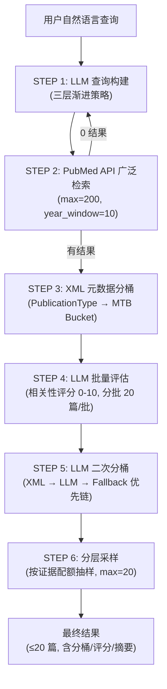
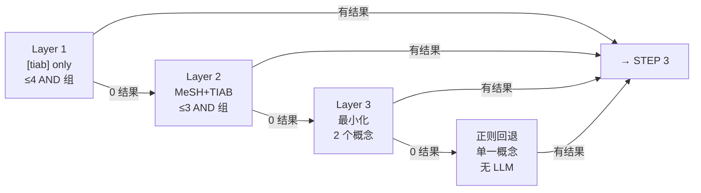
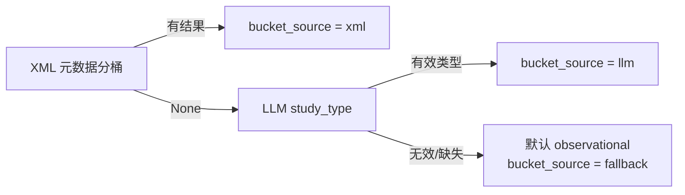

# SmartPubMed 智能文献检索系统 -- 技术文档

## 1. 概述

SmartPubMed 是 MTB 系统中的核心文献检索组件，负责将自然语言临床查询转化为高质量的 PubMed 文献集合。它解决了传统 PubMed 检索中的三个核心问题：

1. **查询构建**：临床医生的自然语言描述无法直接用于 PubMed 布尔检索，需要转化为结构化查询
2. **文献筛选**：PubMed API 返回的文献中大量与临床问题无关，需要智能过滤
3. **证据分级**：MTB 讨论需要按证据类型（指南、RCT、观察性研究等）分层引用文献

SmartPubMed 通过 **LLM 驱动的 6 步 Pipeline** 解决这些问题，从 200 篇广泛检索结果中筛选出最多 20 篇高质量、分类明确的文献。

---

## 2. 整体架构

### Pipeline 流程



### 数据流概要


| 步骤   | 输入           | 输出                    | 关键机制                |
| -------- | ---------------- | ------------------------- | ------------------------- |
| STEP 1 | 自然语言查询   | PubMed 布尔查询字符串   | LLM 三层渐进宽泛        |
| STEP 2 | 布尔查询字符串 | ~200 篇原始文章         | NCBI E-utilities API    |
| STEP 3 | 原始文章列表   | 文章 + XML 分桶标签     | PublicationType 映射    |
| STEP 4 | 文章 + 摘要    | 通过的文章 (score >= 5) | LLM 批量评估            |
| STEP 5 | 通过的文章     | 文章 + 最终分桶         | XML/LLM/Fallback 优先链 |
| STEP 6 | 分桶后的文章   | ≤20 篇最终结果         | 配额驱动分层采样        |

---

## 3. 三层查询构建策略

SmartPubMed 采用 **渐进宽泛** 的三层查询策略。每一层失败后，下一层会收到所有之前失败的查询作为上下文，从而更有针对性地调整策略。

### 3.1 Layer 1: 高精度 `[tiab]` 检索

**目标**：用最精确的查询命中高度相关的文献。

**策略要点**：

- 仅使用 `[tiab]`（标题/摘要）字段标签，不使用 MeSH
- 每个概念内部用 OR 连接同义词，概念之间用 AND 连接
- **最多 4 个 AND 组**，按以下优先级选择概念：
  1. 疾病/癌种 -- 始终包含
  2. 基因/变异 -- 有则包含
  3. 药物名称 -- 仅在查询核心聚焦于药物时包含
  4. 机制/结局 -- 仅在前 3 组未满时包含
- 丢弃：地理位置（China, Japan）、分期信息、次要修饰词、生物标志物亚型（MSS, TMB-H）
- 合并相关概念为 OR 组（如 SHP2 + SOS1 + inhibitor → 一个 OR 组）
- 展开常见缩写（CRC → colorectal cancer）
- 合并基因+变异为短语（KRAS G12C → `"KRAS G12C"[tiab]`）

**实例**：


| 用户查询                                                                       | Layer 1 生成                                                                                                                                                  | 结果   |
| -------------------------------------------------------------------------------- | --------------------------------------------------------------------------------------------------------------------------------------------------------------- | -------- |
| KRAS G12C colorectal cancer resistance SHP2 SOS1 inhibitor China               | `("colorectal cancer"[tiab] OR ...) AND ("KRAS G12C"[tiab]) AND ("SHP2"[tiab] OR "SOS1"[tiab] OR "resistance"[tiab])`                                         | 84 篇  |
| KRAS G12C colorectal cancer prognosis moderately differentiated adenocarcinoma | `("colorectal cancer"[tiab] OR ...) AND ("KRAS G12C"[tiab]) AND ("prognosis"[tiab] OR ...) AND ("moderately differentiated"[tiab] OR "adenocarcinoma"[tiab])` | 86 篇  |
| ATM germline mutation colorectal cancer TMB-H MSS                              | `("colorectal cancer"[tiab] OR ...) AND ("ATM"[tiab]) AND ("germline"[tiab]) AND ("mutation"[tiab] OR "variant"[tiab])`                                       | 112 篇 |

注意 Layer 1 丢弃了 "China"、"TMB-H"、"MSS" 等次要概念，将 AND 组控制在 3-4 个。

### 3.2 Layer 2: MeSH + TIAB 双保险

**触发条件**：Layer 1 返回 0 结果。

**策略要点**：

- 对每个概念同时使用 MeSH 和自由文本：`("MeSH Term"[MeSH] OR "free text"[tiab])`
- 扩展药物同义词：通用名 + 商品名 + 开发代号（如 osimertinib / Tagrisso / AZD9291）
- 扩展变异表示法：L858R / "exon 21" / "p.L858R"
- **必须比 Layer 1 使用更少的 AND 组，最多 3 个**
- 分析 Layer 1 失败原因，主动删除可能导致零结果的 AND 组
- 对罕见/新药查询，丢弃联合用药伙伴，只保留稀有药物 + 疾病

**实例**：

查询 `Fulzerasib cetuximab colorectal cancer IBI351`：

- Layer 1 失败（Fulzerasib AND cetuximab AND colorectal cancer = 0 篇）
- Layer 2 删除了 cetuximab（联合用药伙伴），只保留稀有药物 + 疾病：
  ```
  ("Colorectal Neoplasms"[MeSH] OR "colorectal cancer"[tiab] OR "CRC"[tiab])
  AND ("fulzerasib"[tiab] OR "IBI351"[tiab] OR "IBI-351"[tiab] OR "GFH925"[tiab] OR "GFH-925"[tiab])
  ```
- 结果：2 篇（Fulzerasib 在 PubMed 上只有 2 篇论文）

**MeSH 双保险机制说明**：

即使 LLM 生成了不存在的 MeSH 术语，由于每个概念组内用 OR 连接了 `[tiab]` 备选项，不存在的 MeSH 项只会匹配 0 篇，但 `[tiab]` 项仍能正常命中。因此 MeSH 错误不会导致零结果——零结果的真正原因始终是 AND 组过多。

### 3.3 Layer 3: 最小回退

**触发条件**：Layer 1 和 Layer 2 均返回 0 结果。

**策略要点**：

- 仅保留 **2 个最核心概念**（通常是疾病 + 基因/变异）
- 丢弃所有药物名、干预措施、机制、修饰词
- 使用简单 `[tiab]` 检索，不使用 MeSH
- 每个概念 2-3 个同义词，用一个 AND 连接

**实例**：

查询 `KRAS G12C colorectal cancer resistance SHP2 SOS1 inhibitor China`（优化前 Layer 1/2 均失败时）：

```
("colorectal cancer"[tiab] OR "CRC"[tiab]) AND ("KRAS G12C"[tiab] OR "G12C"[tiab])
```

结果：200 篇

### 3.4 正则回退（无 LLM）

**触发条件**：三层 LLM 查询均返回 0 结果。

不调用 LLM，纯正则提取查询中最有信息量的单一概念。优先级：

1. **基因+变异**：如 `"KRAS G12C"` -- 匹配 `大写字母+数字 空格 字母+数字+字母` 模式
2. **药物名称**：按后缀匹配（-inib, -tinib, -umab, -izumab, -ximab, -rasib, -clib, -lisib, -parib）
3. **基因名称**：2-6 个大写字母/数字，排除非基因缩写（AND, OR, CRC, MSS 等）
4. **疾病名称**：硬编码的常见癌种模式（colorectal cancer, NSCLC, breast cancer 等）
5. **首个非通用词**（长度 >= 3）
6. **最终兜底**：查询的第一个词

### 3.5 层级回退流程总结



**关键行为**：链条在第一个返回任何结果的层级短路。每层失败的查询会累积传递给后续层作为上下文。

### 3.6 同义词生成机制

目前，所有层的同义词均由 LLM 推理生成，没有外部同义词词典或 API 查询。LLM 根据训练数据中的知识生成药物别名（通用名/商品名/开发代号）、MeSH 术语、变异表示法等。

**局限性**：

- LLM 知识有截止日期，对极新药物可能缺少别名
- MeSH 术语也是 LLM 推测的，但因双保险机制不会导致零结果

---

## 4. PubMed API 检索

### 4.1 两步检索流程

**第一步：检索 PMID 列表** (esearch)

- 接口：`https://eutils.ncbi.nlm.nih.gov/entrez/eutils/esearch.fcgi`
- 输入：布尔查询字符串
- 参数：
  - `retmax`：最大返回数量（默认 200）
  - `sort`：`"relevance"`（按相关性排序）
  - `datetype`：`"pdat"`（按发表日期过滤）
  - `mindate` / `maxdate`：年份窗口（默认近 10 年）
- 输出：PMID 列表

**第二步：获取文章详情** (efetch)

- 接口：`https://eutils.ncbi.nlm.nih.gov/entrez/eutils/efetch.fcgi`
- 输入：PMID 列表（逗号分隔）
- 输出：XML 格式的完整文章元数据
- 解析字段：PMID、标题、作者列表、期刊、年份、完整摘要、PublicationType 列表

### 4.2 速率限制


| 条件       | 最小请求间隔 | 每秒请求数 |
| ------------ | -------------- | ------------ |
| 无 API Key | 0.34 秒      | 3 次       |
| 有 API Key | 0.10 秒      | 10 次      |

系统使用单例模式确保所有 Agent 共享同一个 NCBI 客户端实例和速率限制器。

### 4.3 返回的文章数据结构

每篇文章包含以下原始字段：


| 字段                | 类型         | 说明                        |
| --------------------- | -------------- | ----------------------------- |
| `pmid`              | string       | PubMed ID                   |
| `title`             | string       | 文章标题                    |
| `authors`           | list[string] | 作者列表（姓 + 缩写名）     |
| `journal`           | string       | 期刊名                      |
| `year`              | string       | 发表年份                    |
| `abstract`          | string       | 完整摘要                    |
| `publication_types` | list[string] | PubMed PublicationType 列表 |

---

## 5. LLM 批量评估

### 5.1 评估流程

文章按 **20 篇一批** 发送给 LLM 进行批量评估，使用 **10 个并行线程** 加速处理。

每篇文章提供给 LLM 的信息：PMID、标题、摘要、PublicationType 列表。

### 5.2 评估维度

LLM 对每篇文章评估三个维度：

1. **相关性**：是否讨论了查询中的特定疾病、基因/生物标志物、治疗或临床结局
2. **证据质量**：考虑研究设计强度（Phase III RCT > Phase II > Phase I > 前瞻性队列 > 回顾性 > 病例系列 > 临床前）、样本量、是否报告主要终点
3. **研究类型分类**：分为 6 个 MTB 证据类别之一

### 5.3 评分标准


| 评分范围 | 含义                                              |
| ---------- | --------------------------------------------------- |
| 9-10     | 直接相关 + 高质量证据（大型 RCT、指南、关键研究） |
| 7-8      | 直接相关 + 中等证据（Phase I/II、前瞻性队列）     |
| 5-6      | 部分相关或较低证据质量（回顾性、病例系列）        |
| 1-4      | 仅间接相关或仅限临床前                            |
| 0        | 不相关                                            |

### 5.4 通过阈值

文章必须同时满足以下两个条件才能通过：

- `is_relevant = true`
- `relevance_score >= 5`

### 5.5 LLM 返回字段


| 字段               | 类型         | 说明                      |
| -------------------- | -------------- | --------------------------- |
| `pmid`             | string       | 文章 PMID                 |
| `is_relevant`      | boolean      | 是否相关                  |
| `relevance_score`  | integer 0-10 | 综合相关性 + 证据质量评分 |
| `study_type`       | string       | 研究类型（6 选 1）        |
| `matched_criteria` | list[string] | 匹配的查询条件            |
| `key_findings`     | string       | 关键发现摘要              |

### 5.6 研究类型分类规则

LLM 将文章分类为以下 6 种类型之一：


| 类型                | 说明                                           | PublicationType 信号                        |
| --------------------- | ------------------------------------------------ | --------------------------------------------- |
| `guideline`         | 临床实践指南、共识声明、专家组建议             | Practice Guideline, Consensus               |
| `rct`               | 随机对照试验、临床试验（任何阶段）、干预性研究 | Randomized Controlled Trial, Clinical Trial |
| `systematic_review` | 系统综述、荟萃分析、叙述性综述、文献综述       | Review, Meta-Analysis                       |
| `observational`     | 队列研究、横断面研究、回顾性分析、真实世界数据 | Observational Study, Multicenter Study      |
| `case_report`       | 病例报告、病例系列（通常 < 10 例）             | Case Reports                                |
| `preclinical`       | 体外研究、细胞系实验、动物模型                 | （无对应 PublicationType）                  |

**重要规则**：讨论临床前数据的综述文章应分为 `systematic_review`，而非 `preclinical`。只有报告原始临床前实验结果的文章才分为 `preclinical`。

### 5.7 JSON 解析失败降级

当 LLM 返回的 JSON 无法解析时，系统会进行文本扫描降级处理：

- 检查响应中是否包含文章 PMID（引号包裹）
- 检查是否包含 `"is_relevant": true`（不区分大小写）
- 如果两者都匹配，该文章以 `relevance_score = 5` 通过

### 5.8 实例

查询 `ATM germline mutation colorectal cancer TMB-H MSS`，112 篇文章分 6 批评估：


| 批次     | 文章数  | 评估数     | 通过数 |
| ---------- | --------- | ------------ | -------- |
| 1/6      | 20      | 19         | 12     |
| 2/6      | 20      | 0 (无摘要) | 0      |
| 3/6      | 20      | 19         | 11     |
| 4/6      | 20      | 0 (无摘要) | 0      |
| 5/6      | 20      | 18         | 13     |
| 6/6      | 12      | 11         | 7      |
| **合计** | **112** | **67**     | **43** |

注意批次 2 和 4 中文章无摘要，自动跳过 LLM 评估。

---

## 6. XML 元数据分桶

### 6.1 PublicationType 映射表

系统维护一个从 PubMed XML `PublicationType` 到 MTB 证据桶的完整映射：


| PubMed PublicationType                | MTB Bucket          |
| --------------------------------------- | --------------------- |
| Practice Guideline                    | `guideline`         |
| Guideline                             | `guideline`         |
| Consensus Development Conference      | `guideline`         |
| Consensus Development Conference, NIH | `guideline`         |
| Randomized Controlled Trial           | `rct`               |
| Clinical Trial                        | `rct`               |
| Clinical Trial, Phase I               | `rct`               |
| Clinical Trial, Phase II              | `rct`               |
| Clinical Trial, Phase III             | `rct`               |
| Clinical Trial, Phase IV              | `rct`               |
| Controlled Clinical Trial             | `rct`               |
| Pragmatic Clinical Trial              | `rct`               |
| Systematic Review                     | `systematic_review` |
| Meta-Analysis                         | `systematic_review` |
| Review                                | `systematic_review` |
| Observational Study                   | `observational`     |
| Multicenter Study                     | `observational`     |
| Comparative Study                     | `observational`     |
| Case Reports                          | `case_report`       |

### 6.2 多类型优先级规则

当一篇文章有多个 PublicationType 时，系统选择 **优先级最高** 的桶。优先级排序：

```
guideline (最高) > rct > systematic_review > observational > case_report > preclinical (最低)
```

**实例**：

- `["Clinical Trial, Phase I", "Multicenter Study"]` → `rct`（rct 优先级高于 observational）
- `["Journal Article", "Review"]` → `systematic_review`
- `["Journal Article", "Research Support, Non-U.S. Gov't"]` → 无法分类（需 LLM 二次分桶）

### 6.3 临床前启发式检测

如果所有 PublicationType 都无法映射（通常是只有 `"Journal Article"` 的文章），系统会扫描文章标题和摘要中的临床前标志词：


| 标志词       |
| -------------- |
| in vitro     |
| cell line    |
| xenograft    |
| mouse model  |
| animal model |
| preclinical  |
| cell culture |

如果检测到任一标志词，文章被分类为 `preclinical`。否则返回 `None`（待 LLM 二次分桶）。

### 6.4 实例

查询 `KRAS G12C colorectal cancer resistance SHP2 SOS1 inhibitor China`，84 篇文章的 XML 分桶结果：


| XML 分桶结果        | 数量   |
| --------------------- | -------- |
| `rct`               | 6      |
| `systematic_review` | 35     |
| `observational`     | 2      |
| `case_report`       | 1      |
| `preclinical`       | 3      |
| `None` (待 LLM)     | 37     |
| **合计**            | **84** |

约 44% 的文章无法仅通过 XML 元数据分类，需要 LLM 二次分桶。

---

## 7. LLM 二次分桶与 bucket_source 追踪

### 7.1 三级优先链

每篇文章的最终分桶遵循以下优先级链：



1. **XML 优先**：如果 `_classify_publication_bucket()` 返回了桶类型，直接采用。`bucket_source = "xml"`
2. **LLM 补充**：如果 XML 返回 `None`，但 LLM 评估返回了有效的 `study_type`（属于 6 个 MTB 桶之一），采用 LLM 类型。`bucket_source = "llm"`
3. **兜底默认**：如果 XML 和 LLM 都无法分类，默认为 `"observational"`。`bucket_source = "fallback"`

### 7.2 bucket_source 字段

每篇文章携带一个 `bucket_source` 字段，标明分桶来源：


| 值           | 含义                                 |
| -------------- | -------------------------------------- |
| `"xml"`      | 由 PubMed PublicationType 元数据分类 |
| `"llm"`      | 由 LLM 评估的 study_type 分类        |
| `"fallback"` | 默认归入 observational               |

### 7.3 实例

查询 `Fulzerasib cetuximab colorectal cancer IBI351`，2 篇文章的分桶对比：


| PMID     | XML Bucket                    | LLM study_type    | 最终 Bucket       | Source |
| ---------- | ------------------------------- | ------------------- | ------------------- | -------- |
| 40715048 | rct (Clinical Trial, Phase I) | rct               | rct               | xml    |
| 39587006 | None (只有 Journal Article)   | systematic_review | systematic_review | llm    |

PMID 40715048 的 XML 元数据包含 `"Clinical Trial, Phase I"`，直接映射为 `rct`；PMID 39587006 只有 `"Journal Article"`，XML 无法分类，LLM 判断为 `systematic_review`。

### 7.4 skip_filtering 模式

当 `skip_filtering=True` 时（用于简单查询），跳过 LLM 评估步骤。所有 XML 未分类的文章直接以 `"observational"` + `bucket_source="fallback"` 兜底，然后进入分层采样。

---

## 8. 分层采样

### 8.1 证据配额

系统定义了每种证据类型的最大采样配额：


| 证据类型            | 配额   | 优先级 |
| --------------------- | -------- | -------- |
| `guideline`         | 3      | 最高   |
| `rct`               | 6      |        |
| `systematic_review` | 4      |        |
| `observational`     | 4      |        |
| `case_report`       | 2      |        |
| `preclinical`       | 1      | 最低   |
| **合计**            | **20** |        |

### 8.2 采样算法

分层采样分 5 步进行：

**第一步：分桶分组**
将通过评估的文章按 `mtb_bucket` 分入各个桶。

**第二步：桶内排序**
每个桶内按 `relevance_score` 降序排列（最高分优先）。

**第三步：配额选取**
按优先级顺序遍历每个桶，取 `min(配额, 可用数量)` 篇文章。

**第四步：空余再分配**
如果某些桶为空导致总数不足 `max_results`，空余名额会按优先级顺序分配给有剩余文章的桶。这意味着高优先级证据类型在再分配中优先获益。

**第五步：最终排序**
按 `(桶优先级升序, relevance_score 降序)` 排列最终结果。输出顺序：指南 → RCT → 系统综述 → 观察性 → 病例报告 → 临床前。同桶内高分文章在前。

### 8.3 实例

查询 `ATM germline mutation colorectal cancer TMB-H MSS`，43 篇通过评估的文章分布：


| 桶                  | 可用文章数 | 配额   | 选取数 | 剩余   |
| --------------------- | ------------ | -------- | -------- | -------- |
| `guideline`         | 0          | 3      | 0      | 0      |
| `rct`               | 4          | 6      | 4      | 0      |
| `systematic_review` | 1          | 4      | 1      | 0      |
| `observational`     | 34         | 4      | 4      | 30     |
| `case_report`       | 3          | 2      | 2      | 1      |
| `preclinical`       | 1          | 1      | 1      | 0      |
| **小计**            | **43**     | **20** | **12** | **31** |

空余名额 = 20 - 12 = 8，按优先级从 observational（剩余最多）再分配：


| 再分配桶        | 补充数 |
| ----------------- | -------- |
| `case_report`   | +1     |
| `observational` | +7     |

最终结果：20 篇（rct:4, systematic_review:1, observational:11, case_report:3, preclinical:1）。

---

## 9. 辅助机制

### 9.1 查询正则清理

在正则回退之前，系统会对原始查询进行清理：


| 操作           | 示例                                           |
| ---------------- | ------------------------------------------------ |
| 去除中文字符   | `"KRAS突变 colorectal"` → `"KRAS colorectal"` |
| 去除带单位数值 | `"TMB 2+ mut/Mb"` → `"TMB"`                   |
| 去除临床评分   | `"ECOG 1"` → `""`                             |
| 蛋白变异简化   | `"p.G12C"` → `"G12C"`                         |
| 压缩空白       | 多余空格合并                                   |

### 9.2 LLM 调用参数

所有 SmartPubMed 的 LLM 调用使用以下配置：


| 参数                | 值                             | 说明             |
| --------------------- | -------------------------------- | ------------------ |
| 模型                | `SUBGRAPH_MODEL`（Flash 模型） | 成本效率优先     |
| 温度                | 0.1                            | 低温保证输出稳定 |
| 超时                | 30 秒                          | 单次 LLM 调用    |
| 查询构建 max_tokens | 400                            | 查询字符串较短   |
| 批量评估 max_tokens | 2000                           | JSON 输出较长    |

LLM 响应会自动去除 Markdown 代码块包装（` ```json ... ``` `）。

---

## 10. 配置参数

### 来自 `config/settings.py`


| 参数                        | 默认值                            | 说明                          |
| ----------------------------- | ----------------------------------- | ------------------------------- |
| `SUBGRAPH_MODEL`            | `"google/gemini-3-flash-preview"` | SmartPubMed 使用的 LLM 模型   |
| `DEFAULT_YEAR_WINDOW`       | `10`                              | 检索时间窗口（年）            |
| `PUBMED_BROAD_SEARCH_COUNT` | `200`                             | API 级广泛检索池大小          |
| `PUBMED_BUCKET_QUOTAS`      | 见 8.1 配额表                     | 分层采样配额                  |
| `OPENROUTER_API_KEY`        | 环境变量                          | OpenRouter API 密钥           |
| `NCBI_API_KEY`              | 配置值                            | NCBI API 密钥（提升速率限制） |

### 硬编码常量


| 参数         | 值       | 说明             |
| -------------- | ---------- | ------------------ |
| 批量大小     | 20 篇/批 | LLM 评估分批大小 |
| 并行线程数   | 10       | 批量评估并行线程 |
| esearch 超时 | 30 秒    | PMID 列表检索    |
| efetch 超时  | 60 秒    | 文章详情获取     |

---

## 11. 与 MTB 系统集成

### 11.1 调用链路

```
Agent (Pathologist/Geneticist/...)
  → 工具调用 PubMedTool
    → SmartPubMedSearch.search()
      → 6 步 Pipeline
        → 返回 (文章列表, 查询字符串)
```

### 11.2 Agent 可用参数

通过 PubMedTool 暴露的参数：


| 参数          | 类型    | 默认值 | 说明           |
| --------------- | --------- | -------- | ---------------- |
| `query`       | string  | 必填   | 自然语言查询   |
| `max_results` | integer | 5      | 最终返回文章数 |
| `year_window` | integer | 10     | 检索时间窗口   |

注意：PubMedTool 层的 `max_results` 默认值为 5（非 SmartPubMed 内部默认的 20），Agent 通常请求较少文章以控制上下文长度。

### 11.3 单例模式

SmartPubMed 使用模块级单例，确保：

- 所有 Agent 共享同一个 LLM 客户端
- 所有 Agent 共享同一个 NCBI 速率限制器
- 避免重复初始化

---

## 附录：5 份测试报告数据汇总


| 查询                                        | Layer 命中 | API 返回 | LLM 通过 | 最终采样（MAX: 20） |
| --------------------------------------------- | ------------ | ---------- | ---------- | ---------- |
| KRAS G12C ... SHP2 SOS1 China               | Layer 1    | 84       | 52       | 20       |
| Fulzerasib cetuximab CRC IBI351             | Layer 2    | 2        | 2        | 2        |
| Fulzerasib cetuximab ... KRAS G12C efficacy | Layer 1    | 17       | 13       | 13       |
| KRAS G12C ... prognosis adenocarcinoma      | Layer 1    | 86       | 52       | 20       |
| ATM germline ... TMB-H MSS                  | Layer 1    | 112      | 43       | 20       |
